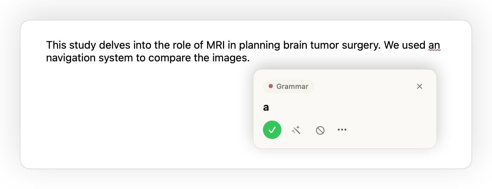
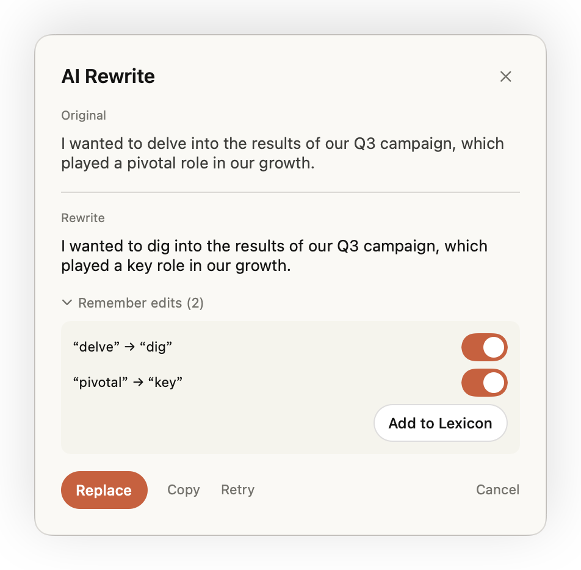
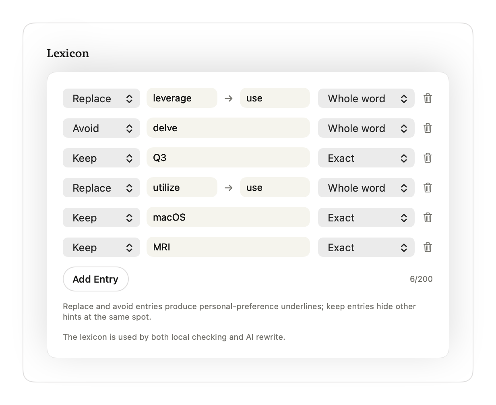
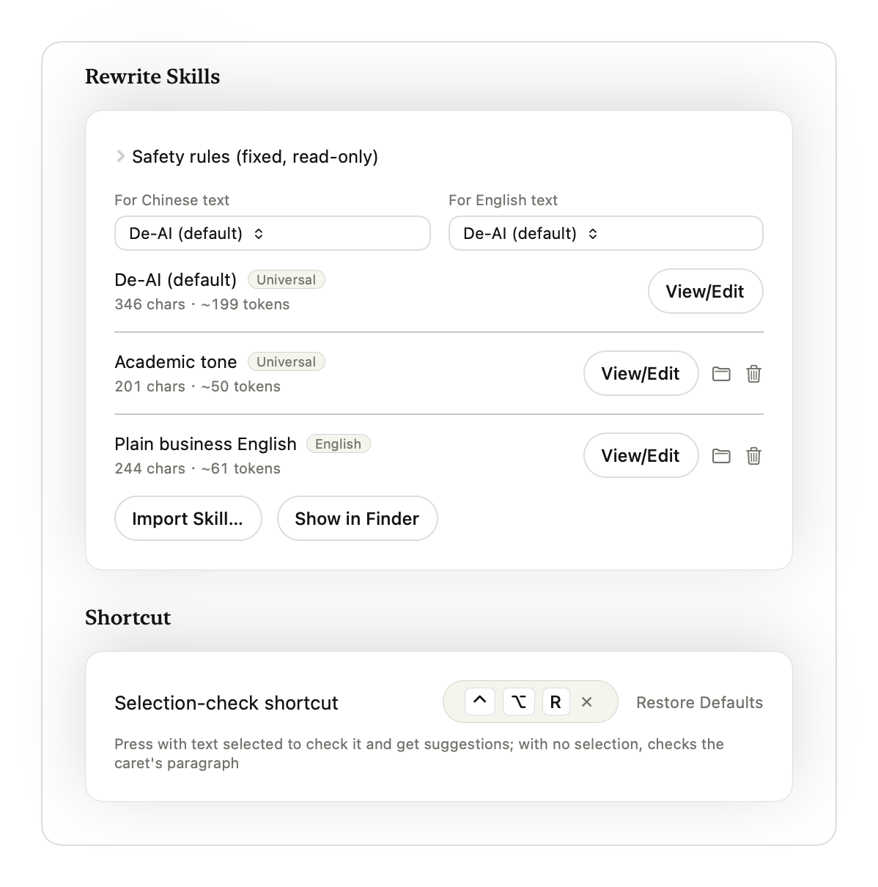

<p align="center"><b>English</b> | <a href="README.zh-CN.md">简体中文</a></p>

<div align="center">
  
  <h1>DeAI</h1>
  <p>A writing assistant for Word, TextEdit and Notes on macOS.</p>
</div>

DeAI underlines stock phrases, English grammar issues and leftover Markdown as you write. Click an underline to review a suggestion, or ask your chosen model to rewrite the paragraph and compare the changes before applying them.

[](docs/demo/deai-demo.mp4)

[Watch the MP4](docs/demo/deai-demo.mp4) · macOS 14 or later · Chinese and English

## What it does

- **Check as you type.** Local rules flag common Chinese and English writing patterns; [Harper](https://github.com/Automattic/harper) checks English grammar and spelling. Adjust the sensitivity or turn individual rules off.
- **Clean up pasted text.** Remove Markdown markers such as `**bold**`, headings and links from plain text.
- **Review a selection.** Select a passage and press <kbd>Control</kbd> + <kbd>Option</kbd> + <kbd>R</kbd> to go through its findings one at a time.
- **Rewrite with a model.** Open AI rewrite from a suggestion card, compare the original and result, then accept or cancel.
- **Keep your preferences.** Add replacements, words to avoid and terms to preserve to a personal lexicon. Import a Markdown file or a folder containing `SKILL.md` as rewrite guidance, with separate choices for Chinese and English.

DeAI runs in the menu bar. Settings let you choose which apps and checks to enable, change underline styles, and switch between Chinese and English. Writing-pattern matches are editing suggestions, not a test of who wrote the text.

## App compatibility

DeAI reads and edits text through macOS Accessibility. The host app must expose both the text and its position on screen.

| App | Current status |
| --- | --- |
| Microsoft Word | Demonstrated with Word 16.113, including page-based text access. |
| TextEdit, Apple Notes | Checking, suggestion cards and text replacement demonstrated. |
| Chrome | Web-page text could not be read in testing; unsupported. |
| Safari | Some input text could be read, but findings did not appear; unsupported. |
| Other apps | Depends on their Accessibility implementation; not verified. |

The browser group is experimental and disabled by default. Enabling it does not make browsers supported. Terminals and password managers on the [built-in exclusion list](mac/DeAI/Settings/AppGroups.swift) are never checked.

## Build and install

There is no GitHub Release, ready-made download or App Store listing yet. Build from source for now. Instructions for a complete trial app, if one is supplied later, are included below.

DeAI requires macOS 14 or later. The Release build checked so far contains Apple Silicon and Intel binaries, uses ad-hoc signing and is not notarized by Apple. The full first-download, permission and usage flow has not been tested on another Mac, nor has first installation been verified separately on both architectures.

### Build from source

Build from source with Xcode, [Rust](https://rustup.rs) and [XcodeGen](https://github.com/yonaskolb/XcodeGen). Install XcodeGen with `brew install xcodegen` if you use Homebrew. Select the full Xcode installation as your active developer directory.

```sh
git clone https://github.com/YouAI-Liu/deai-writer.git
cd deai-writer
source ~/.cargo/env
rustup target add aarch64-apple-darwin x86_64-apple-darwin
./core/scripts/build-apple.sh

cd mac
xcodegen
xcodebuild -project DeAI.xcodeproj -scheme DeAI \
  -configuration Release -derivedDataPath build/dd build
mkdir -p ~/Applications
rsync -a --delete build/dd/Build/Products/Release/DeAI.app/ ~/Applications/DeAI.app/
open ~/Applications/DeAI.app
```

The Apple build script produces a universal library for Apple Silicon and Intel. Both trailing slashes in the `rsync` command matter: it updates the installed app's contents instead of nesting another app inside it.

Release builds use ad-hoc signing unless you copy [Local.xcconfig.example](mac/Local.xcconfig.example) to `mac/Local.xcconfig` and set your own Apple Development team before building. This local file is ignored by Git. Apple Development is a development signature; it is not a [Developer ID signature](https://developer.apple.com/developer-id/) for distribution and does not mean the app is notarized.

### If you receive a complete trial app

If the project maintainer supplies a complete `DeAI.app` later, extract it, move it into Applications (`/Applications` or `~/Applications`) and open it from that fixed location. Recipients of the complete app do not need Xcode or Rust. Follow the instructions supplied with that particular build; there is currently no trial download link.

### If macOS blocks the first launch

Gatekeeper may block an unnotarized app on first launch. If the alert says the developer cannot be verified or Apple cannot check for malicious software, first confirm that the source is trustworthy and the app has not been tampered with. Then follow [Apple's instructions](https://support.apple.com/en-gb/102445):

1. After attempting to open the app, go to **System Settings → Privacy & Security**.
2. Find the alert for this app and click **Open Anyway**.
3. Click **Open** in the confirmation dialog.

If the alert reports malware, says the app will damage your computer or is damaged, or you find a signature problem, stop and contact the maintainer. Do not treat every warning as a notarization issue.

### First launch

1. Open DeAI from its installed location. Its controls appear in the menu bar.
2. Add and enable that `DeAI.app` in **System Settings → Privacy & Security → Accessibility**. DeAI uses this permission to read text, position underlines and apply edits in other apps.
3. Open a document in Word, TextEdit or Notes and start typing. Click an underline to see the suggested edit. You can also ignore a finding or disable its rule.
4. For a longer passage, select it and press **Control + Option + R**. The shortcut is configurable in Settings.

Local rules and English grammar checks work without an API key. For model rewrites, configure your own service in **Settings → AI Rewrite**. Review the result and click Replace to change the document. Connection details are in the next section.

Keep the installed app at the same path when updating. After an ad-hoc rebuild or update, you may need to remove the old Accessibility entry, add the current app and grant access again. For everyday use, launch the installed Release app; Debug uses a separate bundle ID.

## Models and data

To use AI rewrite, add a provider in Settings, enter its base URL, model ID and API key, then test the connection. Presets are available for OpenCode Go, OpenAI, Anthropic, DeepSeek, Gemini, Ollama and LM Studio. Custom endpoints can use OpenAI Chat Completions, OpenAI Responses or Anthropic Messages. The endpoint and model must support the selected format; a preset is not a guarantee that every model works.

For Ollama or LM Studio, start the local server and enter the name of a model it serves. Their presets do not require an API key. Rewrite skills supply text instructions to the model; DeAI does not run scripts from imported skills.

| Action | Data flow |
| --- | --- |
| Typing and local checks | Text is checked on your Mac by the Rust core. No model request is made. |
| AI rewrite | DeAI sends the rewrite text, finding hints, valid personal lexicon entries and selected skill body to the configured endpoint. A card rewrite uses the paragraph containing the finding. |
| Test connection | Sends a fixed probe message to that endpoint. |
| Save settings | API keys go in macOS Keychain. Preferences, lexicon and imported skills are stored locally. |

DeAI has no telemetry or DeAI account. A cloud endpoint receives rewrite content under that provider's data policy. For a local rewrite, use a server and model that actually run on your Mac; choosing a provider label alone does not establish where processing happens.

## Screenshots

| Suggestions | AI rewrite |
| --- | --- |
|  |  |
|  |  |

[More screenshots](docs/images/en)

## Development

```text
core/    Rust checks, Harper integration, UniFFI and WASM bindings
mac/     SwiftUI app, Accessibility integration, overlays and model client
tools/   Accessibility inspection tool (ax-probe)
docs/    Writing samples, demo and screenshots
```

After building the Apple library and generating the Xcode project above, run these from the repository root:

```sh
source ~/.cargo/env
(cd core && cargo test --workspace)
(cd mac && xcodebuild -project DeAI.xcodeproj -scheme DeAI \
  -derivedDataPath build/dd test)

# Optional WASM target; requires wasm-pack and Node.js
(cd core/crates/deai-wasm && wasm-pack build --target nodejs && node tests/smoke.mjs)

# Inspect an app's Accessibility tree after a three-second delay
(cd tools/ax-probe && swift build && .build/debug/ax-probe 3)
```

Finding offsets are UTF-16 code units. See [the rule reference](core/crates/deai-core/RULES.md) for matching behavior and [AGENTS.md](AGENTS.md) for build and Accessibility notes.

Bug reports and pull requests are welcome through this repository's Issues and Pull requests tabs. For an app compatibility issue, include the macOS and app versions, reproduction steps and a short non-sensitive text sample. For a rule change, include examples that should match and examples that should stay unchanged.

## License and credits

DeAI is licensed under [MIT](LICENSE). English grammar comes from [Harper](https://github.com/Automattic/harper); Chinese writing rules derive from [lieflat-less-ai-tone](https://github.com/larashero3-dotcom/lieflat-less-ai-tone), and English writing rules from [blader/humanizer](https://github.com/blader/humanizer). Attribution, license texts and the dependency inventory are in [THIRD_PARTY_NOTICES.md](THIRD_PARTY_NOTICES.md).
