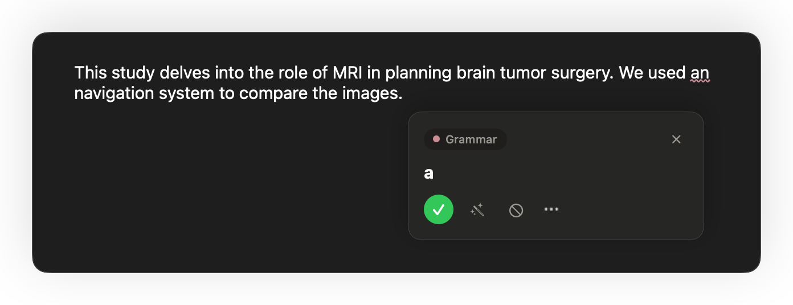
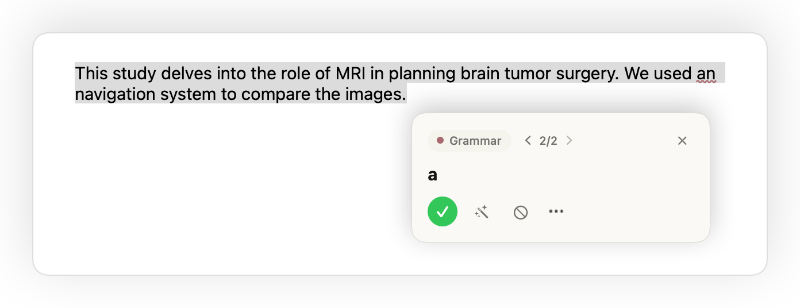
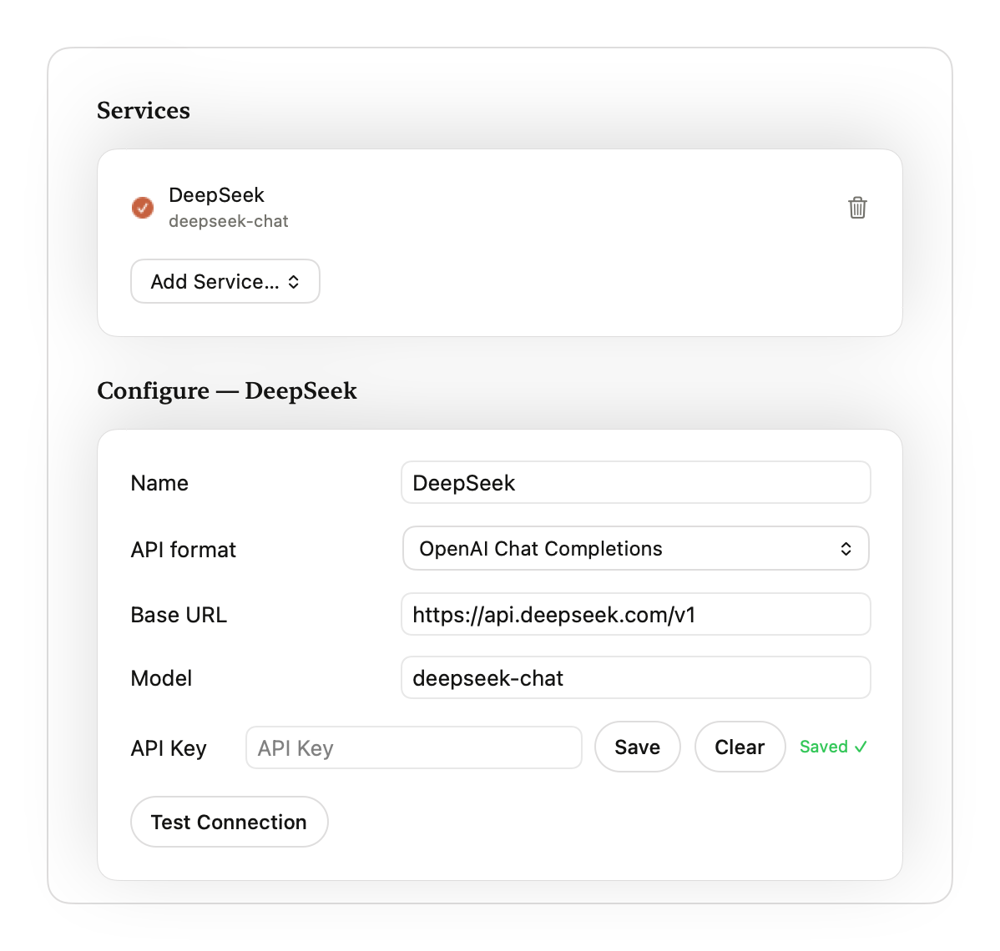
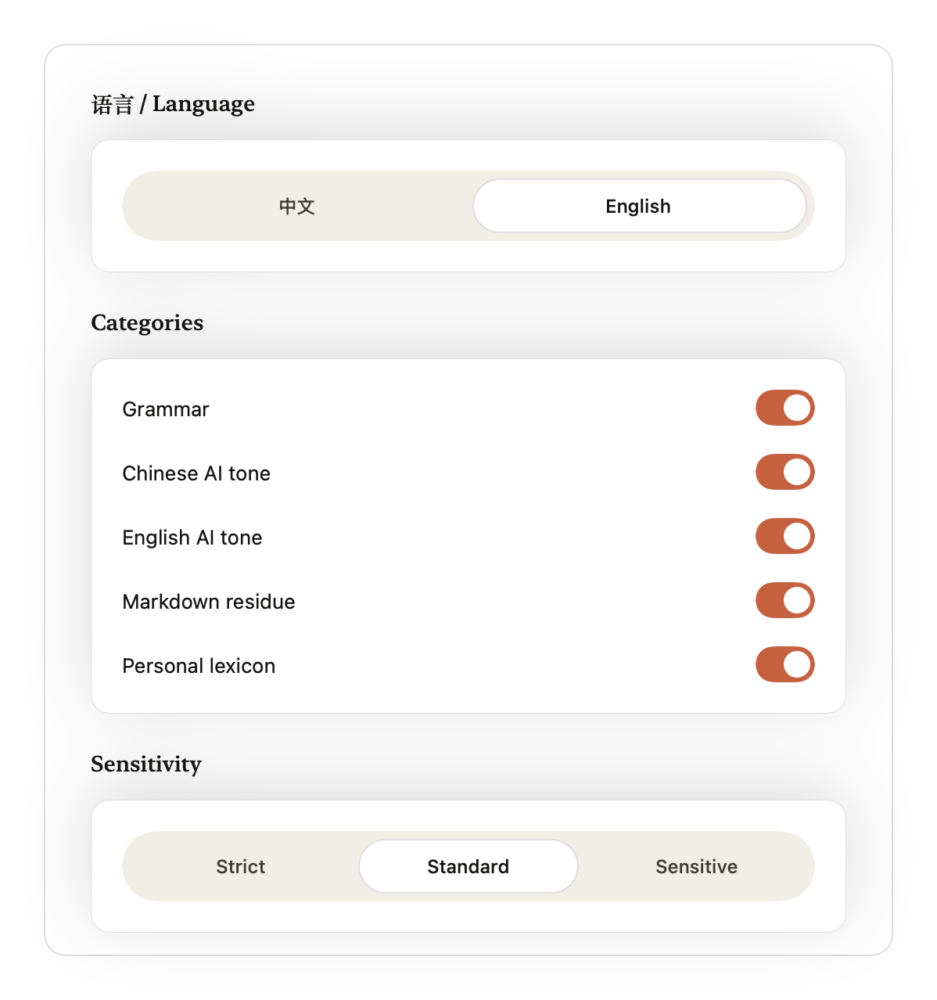
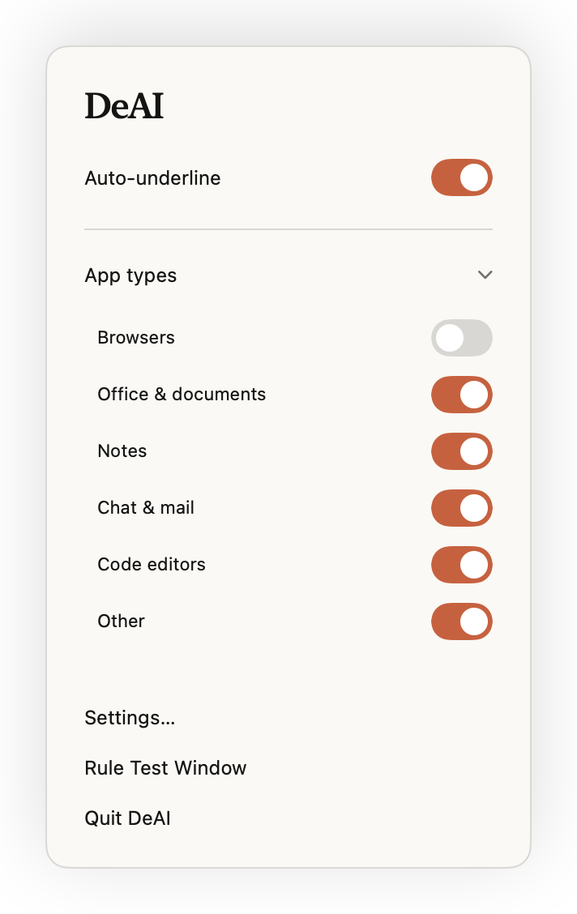

<p align="center"><b>English</b> | <a href="README.zh-CN.md">简体中文</a></p>

<div align="center">
  
  <h1>DeAI</h1>
  <p><b>Make your writing sound like you, not AI.</b></p>
  <p>
    
    
    
    
  </p>
</div>

<!-- hero: demo GIF/video goes here -->

DeAI is a menu bar app that checks your writing as you type, in the apps you already use. It underlines AI-sounding phrasing, English grammar issues and leftover Markdown, and offers a fix or an AI rewrite on click.

## Features

- **System-wide underlines.** DeAI reads the focused text field through macOS Accessibility and draws underlines over it; clicking one opens a suggestion card. Works in apps that expose their text through Accessibility, such as Word, TextEdit and Notes. Browsers have their own app group, which is off by default and can be turned on in Settings.
- **English grammar.** Grammar and spelling checks are powered by [Harper](https://github.com/Automattic/harper).
- **AI-tone detection in Chinese and English.** Rule-based detection of common AI writing patterns, with three sensitivity levels.
- **Markdown residue cleanup.** Flags `**bold**`, `#` headings, list bullets, links and other Markdown that leaked into plain text.
- **Selection check.** Select text and press the hotkey (default <kbd>⌃</kbd><kbd>⌥</kbd><kbd>R</kbd>) to step through every issue in the selection one card at a time.
- **AI rewrite.** Rewrite a sentence from the suggestion card and review the diff before applying it. Provider presets: OpenCode Go, OpenAI, Anthropic, DeepSeek, Gemini, Ollama, LM Studio, or a custom endpoint, using the OpenAI Chat Completions, OpenAI Responses or Anthropic Messages format.
- **Keys in Keychain.** API keys are stored in the macOS Keychain, never in the settings file.
- **Personal lexicon.** Add words to replace, avoid or keep. Rewrites respect your lexicon, and replacements from a rewrite can be saved to it in one click.
- **Rewrite skills.** Import a Markdown file (or a folder with `SKILL.md`) as a rewrite style and tag it Chinese, English or any. Pick one skill for Chinese text and one for English text; each rewrite uses the skill for the language it detects.
- **Per-app control.** Enable checks per app group (office, notes, chat and mail, code, …) or per app. Terminals and password managers on the built-in exclusion list (`AppGroup.table` in `mac/DeAI/Settings/AppGroups.swift`) are never checked; other unknown apps fall into the “Other” group.
- **Chinese and English UI, light and dark.** The interface follows the system appearance; underline colors and shapes are customizable.

## Screenshots

<table>
  <tr>
    <td width="50%"><br><sub>Suggestion card</sub></td>
    <td width="50%"><br><sub>Suggestion card, dark mode</sub></td>
  </tr>
  <tr>
    <td><br><sub>Selection check</sub></td>
    <td><br><sub>AI rewrite with diff</sub></td>
  </tr>
  <tr>
    <td><br><sub>Settings: AI service and API key</sub></td>
    <td><br><sub>Settings: rewrite skills and shortcut</sub></td>
  </tr>
  <tr>
    <td><br><sub>Settings: Check</sub></td>
    <td><br><sub>Settings: Personal lexicon</sub></td>
  </tr>
  <tr>
    <td><br><sub>Menu bar panel</sub></td>
    <td></td>
  </tr>
</table>

## Privacy

- All checks (grammar, AI tone, Markdown, lexicon) run locally in the bundled Rust core. Nothing you type is sent anywhere while checking.
- When you trigger an AI rewrite, DeAI sends the text to rewrite, the matched issues, your lexicon entries and the selected rewrite skill to the provider you configured.
- "Test connection" in Settings sends only a fixed probe message.
- Rewrites stay on your Mac if you point DeAI at an Ollama or LM Studio server running locally.
- DeAI has no telemetry and no account.

## Requirements

- macOS 14 Sonoma or later
- Accessibility permission (System Settings → Privacy & Security → Accessibility), which DeAI needs to read text and draw underlines in other apps
- An API key for a cloud provider, or a local Ollama / LM Studio server, if you want AI rewrites

## Build from source

Prerequisites: Xcode, [Rust](https://rustup.rs), [XcodeGen](https://github.com/yonaskolb/XcodeGen) and [Homebrew](https://brew.sh) (or install XcodeGen another way). Run all commands from the repository root.

```sh
git clone https://github.com/YouAI-Liu/deai-writer.git
cd deai-writer

# Rust core → universal static library + Swift bindings + DeAICore.xcframework
rustup target add aarch64-apple-darwin x86_64-apple-darwin
./core/scripts/build-apple.sh

# Mac app
brew install xcodegen
(cd mac && xcodegen && xcodebuild -project DeAI.xcodeproj -scheme DeAI -configuration Release build)
```

The app ends up in `~/Library/Developer/Xcode/DerivedData/DeAI-*/Build/Products/Release/DeAI.app`. Copy it to `/Applications` or `~/Applications`.

By default the Release build is ad-hoc signed. To sign with your own Apple Development identity, copy `mac/Local.xcconfig.example` to `mac/Local.xcconfig` and set your team.

Tests:

```sh
(cd core && cargo test --workspace)
(cd mac && xcodebuild -project DeAI.xcodeproj -scheme DeAI test)
```

### First launch

- Builds are not notarized. If macOS blocks DeAI from opening, go to **System Settings → Privacy & Security** and click **Open Anyway**.
- Grant Accessibility permission when asked.
- macOS remembers the Accessibility grant by code signature. With an ad-hoc signed build, every update has a new signature, so you may need to remove DeAI from the Accessibility list and grant it again.

## Project structure

```
core/    Rust core: rule engine, Harper grammar, UniFFI bindings (deai-ffi), WASM build (deai-wasm)
mac/     SwiftUI menu bar app (XcodeGen project in mac/project.yml)
tools/   Developer tools, e.g. ax-probe for inspecting Accessibility trees
docs/    Brand assets, screenshots, demo corpus
```

## Acknowledgements

DeAI builds on [Harper](https://github.com/Automattic/harper) for English grammar. The Chinese rules come from lieflat-less-ai-tone, and the English AI-tone rules from [blader/humanizer](https://github.com/blader/humanizer). See [THIRD_PARTY_NOTICES.md](THIRD_PARTY_NOTICES.md) for details and licenses.

## License

[MIT](LICENSE)
