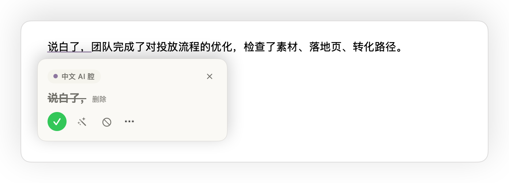
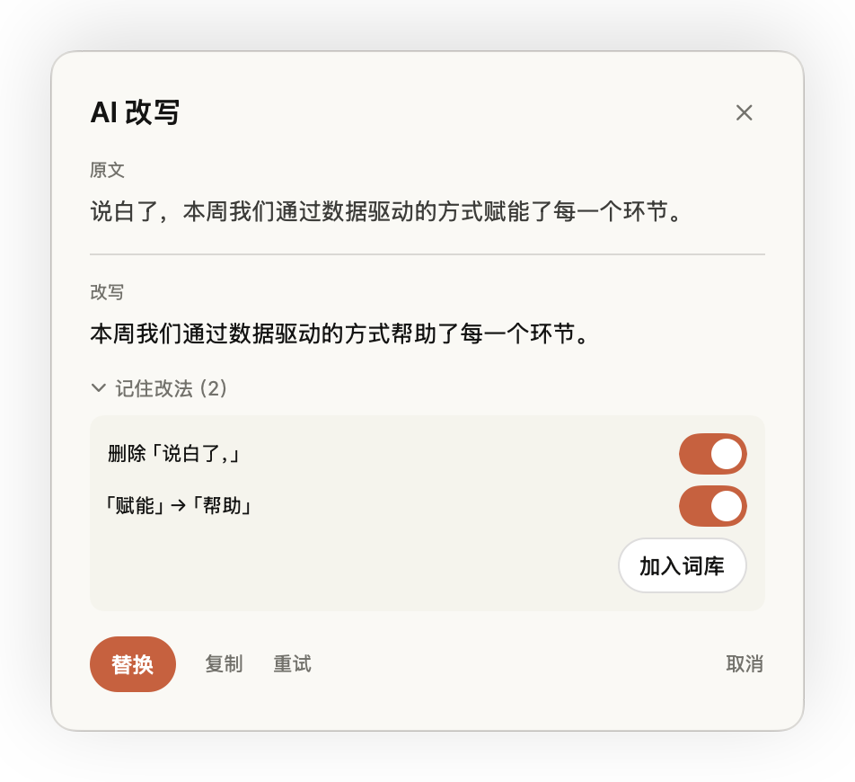
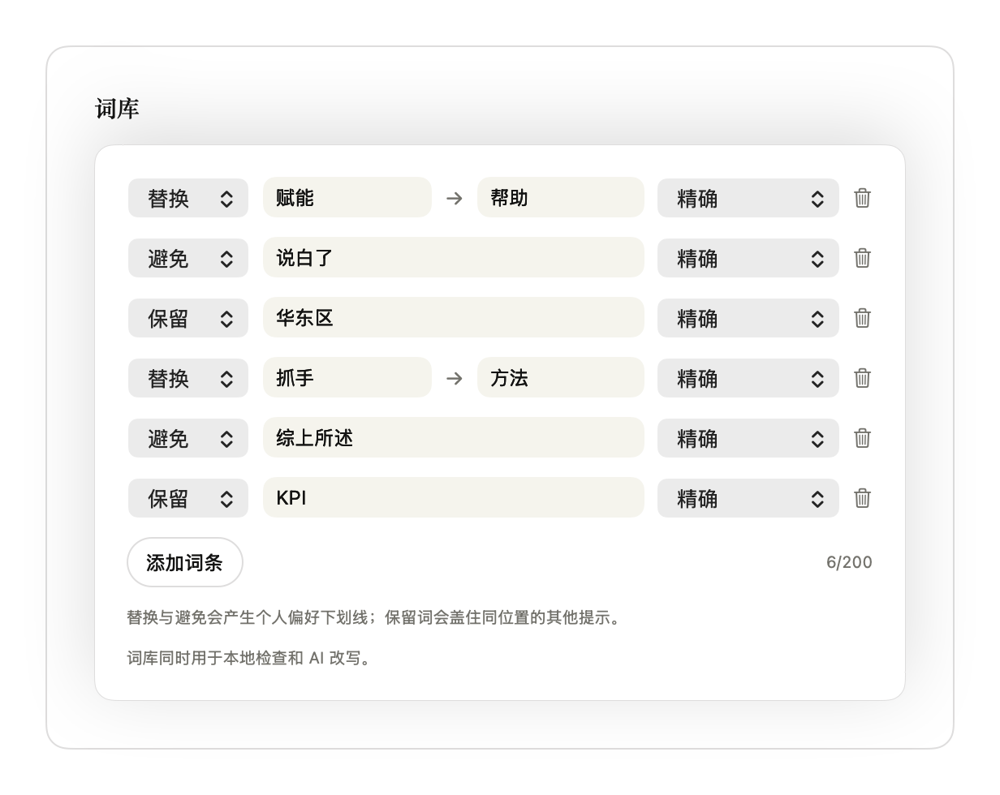
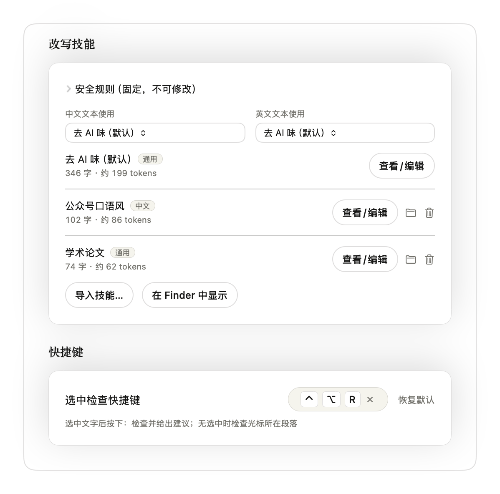

<p align="center"><a href="README.md">English</a> | <b>简体中文</b></p>

<div align="center">
  
  <h1>DeAI</h1>
  <p>在 Mac 的 Word、文本编辑和备忘录里，边写边修改。</p>
</div>

DeAI 会给套话、英文语法问题和残留的 Markdown 标记画下划线。点一下查看建议，也可以让你选的模型改写整段，对照原文看过后再替换。

[](docs/demo/deai-demo.mp4)

[观看 MP4](docs/demo/deai-demo.mp4) · macOS 14 及以上 · 中文与英文

## 能做什么

- **边写边查。** 本地规则检查中英文常见的写作套路，[Harper](https://github.com/Automattic/harper) 检查英文语法和拼写。可以调整灵敏度，也可以关掉不需要的规则。
- **清理粘贴的文字。** 去掉混进正文的 `**加粗**`、标题、链接等 Markdown 标记。
- **检查选中的段落。** 选中文字，按 <kbd>Control</kbd> + <kbd>Option</kbd> + <kbd>R</kbd>，逐条查看问题。
- **用模型改写。** 从建议卡片打开 AI 改写，对照原文与结果，再决定采用或取消。
- **记住自己的写法。** 在个人词库里保存替换、避免和保留的词。可以导入 Markdown 文件或含 `SKILL.md` 的文件夹作为改写指导，中文和英文分别选择。

DeAI 常驻菜单栏。设置里可以选择启用哪些应用和检查项、调整下划线样式、切换中英文界面。规则命中只是修改建议，不能据此判断文字是谁写的。

## 应用兼容性

DeAI 通过 macOS 辅助功能读取和修改文字，需要目标应用提供文字内容及其屏幕位置。

| 应用 | 当前情况 |
| --- | --- |
| Microsoft Word | 已在 Word 16.113 中演示验证，包括分页文字读取。 |
| 文本编辑、Apple 备忘录 | 已演示验证检查、建议卡片和文字替换。 |
| Chrome | 测试中无法读取网页文字，暂不支持。 |
| Safari | 能读到部分输入框文字，但没有显示检查结果，暂不支持。 |
| 其他应用 | 取决于应用的辅助功能实现，尚未验证。 |

浏览器分组仍属实验性功能，默认关闭；在设置里打开不代表已经支持。[内置排除名单](mac/DeAI/Settings/AppGroups.swift) 中的终端和密码管理器始终不检查。

## 构建与安装

下载首个测试版：[DeAI 0.1.0 Preview 1](https://github.com/YouAI-Liu/deai-writer/releases/tag/v0.1.0-preview.1) · [macOS 通用 ZIP](https://github.com/YouAI-Liu/deai-writer/releases/download/v0.1.0-preview.1/DeAI-0.1.0-preview.1-macOS-universal.zip) · [SHA-256 校验文件](https://github.com/YouAI-Liu/deai-writer/releases/download/v0.1.0-preview.1/SHA256SUMS.txt)。DeAI 尚未上架 App Store，也可按下方步骤从源码构建。

最低系统要求为 macOS 14。测试版安装包包含 Apple Silicon 和 Intel 两种架构，使用 ad-hoc（临时）签名，未经过 Apple 公证。尚未完成另一台 Mac 从首次下载、授权到实际使用的完整验证，也未分别完成两种架构的首次安装验证。

### 从源码构建

从源码构建需要 Xcode、[Rust](https://rustup.rs) 和 [XcodeGen](https://github.com/yonaskolb/XcodeGen)。使用 Homebrew 的话，可以运行 `brew install xcodegen`。请将完整的 Xcode 安装设为当前开发工具目录。

```sh
git clone https://github.com/YouAI-Liu/deai-writer.git
cd deai-writer
source ~/.cargo/env
rustup target add aarch64-apple-darwin x86_64-apple-darwin
./core/scripts/build-apple.sh

cd mac
xcodegen
xcodebuild -project DeAI.xcodeproj -scheme DeAI \
  -configuration Release -derivedDataPath build/dd build
mkdir -p ~/Applications
rsync -a --delete build/dd/Build/Products/Release/DeAI.app/ ~/Applications/DeAI.app/
open ~/Applications/DeAI.app
```

Apple 构建脚本生成同时包含 Apple Silicon 和 Intel 架构的通用库。`rsync` 两端路径末尾的斜杠都要保留，这样会更新已安装应用的内容，不会在里面再嵌套一个应用。

Release 默认使用 ad-hoc 签名。如需使用自己的 Apple Development 身份，在构建前将 [Local.xcconfig.example](mac/Local.xcconfig.example) 复制为 `mac/Local.xcconfig`，填入自己的开发者团队。这个本地文件已被 Git 忽略。Apple Development 是开发签名，不等于用于对外分发的 [Developer ID 签名](https://developer.apple.com/developer-id/)，也不代表应用已公证。

发布包通过[打包脚本](mac/scripts/package-release.sh)从指定提交的干净源码构建，排除本地签名配置，并将编译路径替换为通用路径。复现本次构建可运行 `bash mac/scripts/package-release.sh v0.1.0-preview.1 0.1.0-preview.1`；这不保证不同工具链产生逐字节相同的 ZIP。

### 安装测试版

下载上方 ZIP 后解压，将完整的 `DeAI.app` 放入“应用程序”（`/Applications` 或 `~/Applications`），从这个固定位置打开。不需要安装 Xcode 或 Rust；Release 页面自动生成的 Source code 压缩包是源码，不是安装包。

将 ZIP 与 `SHA256SUMS.txt` 放在同一目录，可运行 `shasum -a 256 -c SHA256SUMS.txt` 核对下载内容。更多说明见[测试版安装说明](docs/releases/v0.1.0-preview.1.md)。

### macOS 阻止首次打开时

未经公证的应用首次打开可能被 Gatekeeper 阻止。如果提示开发者无法验证，或 Apple 无法检查是否包含恶意软件，请先确认来源可信、应用未被篡改，再按照 [Apple 官方说明](https://support.apple.com/en-gb/102445)操作：

1. 尝试打开应用后，进入 **系统设置 → 隐私与安全性**。
2. 找到对应的拦截提示，点击 **仍要打开**。
3. 在再次出现的确认框中点击 **打开**。

如果提示应用含恶意软件、会损坏电脑、已损坏，或发现签名异常，请停止安装并联系维护者核实，不要将这些提示一律当作“未公证”处理。

### 首次使用

1. 从安装位置打开 DeAI，在菜单栏找到它。
2. 在 **系统设置 → 隐私与安全性 → 辅助功能** 中添加并启用这个 `DeAI.app`。DeAI 需要这项权限来读取其他应用的文字、定位下划线和应用修改。
3. 打开 Word、文本编辑或备忘录并输入文字。点击下划线查看建议，也可以忽略该问题或停用对应规则。
4. 想集中检查一段文字时，选中后按 **Control + Option + R**。快捷键可在设置里修改。

本地规则和英文语法检查不需要 API 密钥。需要模型改写时，在“设置 → AI 改写”中配置自己的模型服务；查看结果后点击替换，才会修改正文。具体接入方式见下节。

更新时保持安装路径不变。临时签名的应用重新构建或更新后，可能需要从辅助功能列表移除旧条目，再添加并授权当前应用。日常使用请启动安装好的 Release 应用；Debug 使用独立的 bundle ID。

## 模型接入与数据流

需要 AI 改写时，在设置里添加服务商，填写接口地址、模型 ID 和 API 密钥，再测试连接。已有 OpenCode Go、OpenAI、Anthropic、DeepSeek、Gemini、Ollama、LM Studio 预设。自定义接口支持 OpenAI Chat Completions、OpenAI Responses 和 Anthropic Messages 三种格式。接口和模型需要支持所选格式；有预设不代表所有模型都已验证可用。

使用 Ollama 或 LM Studio 时，先启动本地服务，再填写该服务中可用的模型名称。这两个预设不要求 API 密钥。改写技能作为文字指令交给模型，DeAI 不会执行导入技能中的脚本。

| 操作 | 数据去向 |
| --- | --- |
| 输入文字、本地检查 | 文字由 Mac 上的 Rust 核心处理，不请求模型。 |
| AI 改写 | 向配置的接口发送待改写文字、命中提示、有效的个人词库条目和选中的技能正文。从卡片发起的改写会使用问题所在的整段。 |
| 测试连接 | 向该接口发送固定的探测消息。 |
| 保存设置 | API 密钥保存在 macOS 钥匙串；偏好、词库和导入的技能保存在本机。 |

DeAI 没有遥测，也不需要 DeAI 账号。云端接口会收到改写内容，具体处理方式由服务商的数据政策决定。要在本地完成改写，需要服务和模型实际运行在你的 Mac 上；仅选择某个服务商名称并不能确定处理地点。

## 截图

| 修改建议 | AI 改写 |
| --- | --- |
|  |  |
|  |  |

[更多截图](docs/images/zh)

## 开发与测试

```text
core/    Rust 检查、Harper 集成、UniFFI 和 WASM 绑定
mac/     SwiftUI 应用、辅助功能集成、浮层与模型客户端
tools/   辅助功能检查工具 ax-probe
docs/    规则示例、演示与截图
```

按上面的步骤构建 Apple 库并生成 Xcode 项目后，在仓库根目录运行：

```sh
source ~/.cargo/env
(cd core && cargo test --workspace)
(cd mac && xcodebuild -project DeAI.xcodeproj -scheme DeAI \
  -derivedDataPath build/dd test)

# 可选 WASM 目标，需要 wasm-pack 和 Node.js
(cd core/crates/deai-wasm && wasm-pack build --target nodejs && node tests/smoke.mjs)

# 等待三秒后，查看应用的辅助功能树
(cd tools/ax-probe && swift build && .build/debug/ax-probe 3)
```

所有 Finding 偏移以 UTF-16 code unit 为单位。[规则说明](core/crates/deai-core/RULES.md) 记录了匹配行为，[AGENTS.md](AGENTS.md) 记录了构建方法和辅助功能相关注意事项。

欢迎在本仓库的 Issues 和 Pull requests 页面报告问题或提交修改。应用兼容性问题请附 macOS 和应用版本、复现步骤，以及一小段不含私人信息的示例文字。修改规则时，请同时提供应该命中和应该保留原样的例子。

## 许可证与致谢

DeAI 采用 [MIT 许可证](LICENSE)。英文语法检查来自 [Harper](https://github.com/Automattic/harper)，中文写作规则衍生自 [lieflat-less-ai-tone](https://github.com/larashero3-dotcom/lieflat-less-ai-tone)，英文写作规则衍生自 [blader/humanizer](https://github.com/blader/humanizer)。来源、许可证原文和依赖清单见 [THIRD_PARTY_NOTICES.md](THIRD_PARTY_NOTICES.md)。
