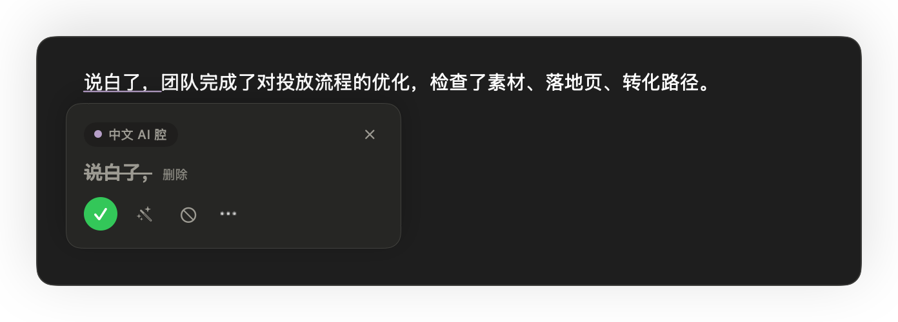
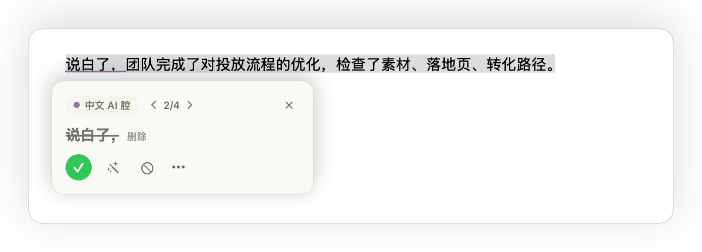
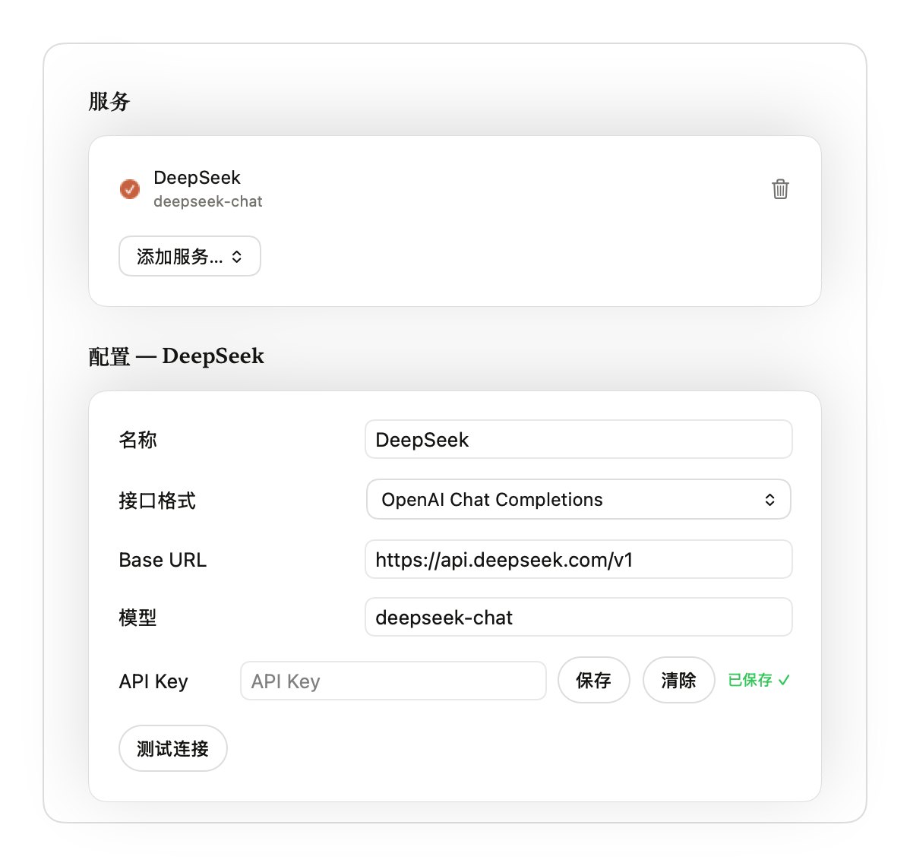
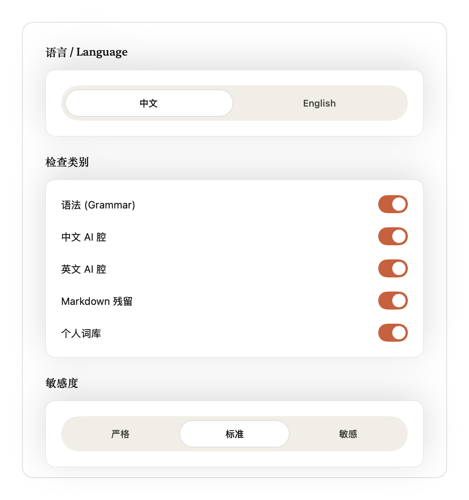
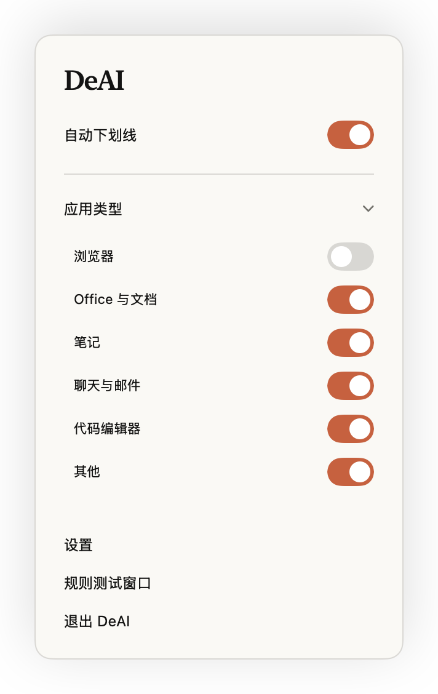

<p align="center"><a href="README.md">English</a> | <b>简体中文</b></p>

<div align="center">
  
  <h1>DeAI</h1>
  <p><b>让文字读起来像你写的，而不是 AI。</b></p>
  <p>
    
    
    
    
  </p>
</div>

<!-- hero: demo GIF/video goes here -->

DeAI 是一个菜单栏应用，在你常用的软件里边写边查。它会给 AI 腔、英文语法问题和残留的 Markdown 标记画下划线，点一下就能看到修改建议，或者交给 AI 改写。

## 功能

- **全局下划线。** 通过 macOS 辅助功能读取当前输入框的文字并在上面画下划线，点击下划线弹出建议卡片。支持通过辅助功能提供文字的应用，例如 Word、文本编辑和备忘录。浏览器单独成组，默认关闭，可在设置里打开。
- **英文语法。** 语法和拼写检查由 [Harper](https://github.com/Automattic/harper) 提供。
- **中英文 AI 腔检测。** 基于规则识别常见的 AI 写作套路，灵敏度分三档。
- **Markdown 残留清理。** 标出混进正文的 `**加粗**`、`#` 标题、列表符号、链接等 Markdown 标记。
- **选区检查。** 选中文字后按快捷键（默认 <kbd>⌃</kbd><kbd>⌥</kbd><kbd>R</kbd>），逐张卡片过一遍选区里的所有问题。
- **AI 改写。** 在建议卡片上一键改写，先看差异再决定是否替换。服务商预设：OpenCode Go、OpenAI、Anthropic、DeepSeek、Gemini、Ollama、LM Studio，也可以自定义接口；支持 OpenAI Chat Completions、OpenAI Responses 和 Anthropic Messages 三种格式。
- **密钥存钥匙串。** API 密钥保存在 macOS 钥匙串里，不写进设置文件。
- **个人词库。** 添加要替换、要避免或要保留的词。改写会遵守词库，改写结果里的替换也能一键存进词库。
- **改写技能。** 导入 Markdown 文件（或含 `SKILL.md` 的文件夹）作为改写风格，标注中文、英文或通用。中文和英文各选一个技能，改写时按识别出的语言选用。
- **按应用控制。** 可以按应用类型（办公、笔记、聊天与邮件、代码……）或单个应用开关检查项。内置排除名单（`mac/DeAI/Settings/AppGroups.swift` 中的 `AppGroup.table`）里的终端和密码管理器始终不检查；名单外的未知应用归入“其他”组。
- **中英文界面，浅色与深色。** 界面跟随系统外观，下划线的颜色和样式可以自定义。

## 截图

<table>
  <tr>
    <td width="50%"><br><sub>建议卡片</sub></td>
    <td width="50%"><br><sub>建议卡片，深色模式</sub></td>
  </tr>
  <tr>
    <td><br><sub>选区检查</sub></td>
    <td><br><sub>AI 改写与差异对比</sub></td>
  </tr>
  <tr>
    <td><br><sub>设置：AI 服务与 API Key</sub></td>
    <td><br><sub>设置：改写技能与快捷键</sub></td>
  </tr>
  <tr>
    <td><br><sub>设置：检查</sub></td>
    <td><br><sub>设置：个人词库</sub></td>
  </tr>
  <tr>
    <td><br><sub>菜单栏面板</sub></td>
    <td></td>
  </tr>
</table>

## 隐私

- 所有检查（语法、AI 腔、Markdown、词库）都在内置的 Rust 核心里本地完成，检查过程中不会把你输入的内容发往任何地方。
- 主动触发 AI 改写时，DeAI 会把待改写文字、命中的问题、词库条目和选中的改写技能发给你配置的服务商。
- 设置里的“测试连接”只发送固定的探测消息。
- 使用本机运行的 Ollama 或 LM Studio 服务时，改写在本地完成。
- 没有遥测，也不需要账号。

## 系统要求

- macOS 14 Sonoma 或更高版本
- 辅助功能权限（系统设置 → 隐私与安全性 → 辅助功能），DeAI 需要它来读取其他应用的文字并画下划线
- 如需 AI 改写：云端服务商的 API 密钥，或本地的 Ollama / LM Studio

## 从源码构建

需要 Xcode、[Rust](https://rustup.rs)、[XcodeGen](https://github.com/yonaskolb/XcodeGen) 和 [Homebrew](https://brew.sh)（也可以用其他方式安装 XcodeGen）。以下命令都在仓库根目录执行。

```sh
git clone https://github.com/YouAI-Liu/deai-writer.git
cd deai-writer

# Rust 核心 → 通用静态库 + Swift 绑定 + DeAICore.xcframework
rustup target add aarch64-apple-darwin x86_64-apple-darwin
./core/scripts/build-apple.sh

# Mac 应用
brew install xcodegen
(cd mac && xcodegen && xcodebuild -project DeAI.xcodeproj -scheme DeAI -configuration Release build)
```

构建产物位于 `~/Library/Developer/Xcode/DerivedData/DeAI-*/Build/Products/Release/DeAI.app`，复制到 `/Applications` 或 `~/Applications` 即可。

Release 构建默认使用 ad-hoc 签名。如需用自己的 Apple Development 身份签名，把 `mac/Local.xcconfig.example` 复制为 `mac/Local.xcconfig` 并填入你的 Team。

测试：

```sh
(cd core && cargo test --workspace)
(cd mac && xcodebuild -project DeAI.xcodeproj -scheme DeAI test)
```

### 首次启动

- 构建未经公证。如果 macOS 阻止打开 DeAI，前往 **系统设置 → 隐私与安全性**，点击 **仍要打开**。
- 按提示授予辅助功能权限。
- macOS 按代码签名记录辅助功能授权。ad-hoc 签名的构建每次更新签名都会变，可能需要在辅助功能列表里移除 DeAI 后重新授权。

## 项目结构

```
core/    Rust 核心：规则引擎、Harper 语法检查、UniFFI 绑定（deai-ffi）、WASM 构建（deai-wasm）
mac/     SwiftUI 菜单栏应用（XcodeGen 项目，见 mac/project.yml）
tools/   开发工具，例如查看辅助功能树的 ax-probe
docs/    品牌素材、截图、演示语料
```

## 致谢

英文语法检查基于 [Harper](https://github.com/Automattic/harper)。中文规则来自 lieflat-less-ai-tone，英文 AI 腔规则来自 [blader/humanizer](https://github.com/blader/humanizer)。详情与许可证见 [THIRD_PARTY_NOTICES.md](THIRD_PARTY_NOTICES.md)。

## 许可证

[MIT](LICENSE)
